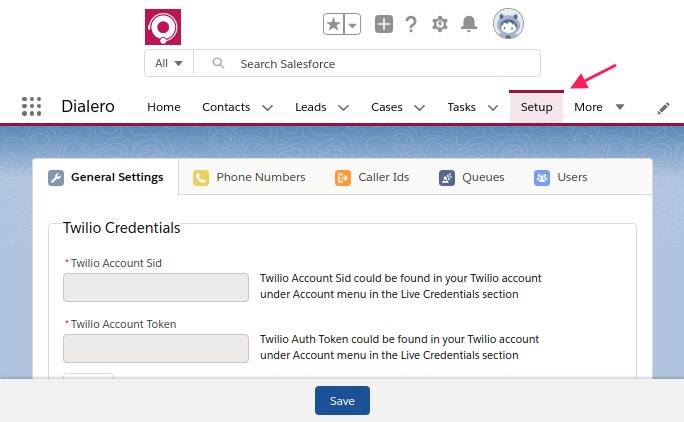

# Configure Dialero App

## Setup Wizard

After first installation of Dialero app navigate to Setup page in **Dialero** Lightning App and follow the Setup Wizard process.

---

## Dialero App Settings

- In **Dialero Settings** tab you will be able to:
  - Update Twilio Credentials
  - Update Default Assigned User
  - Enable/Disable Call Recordings
- In **Manage Numbers** tab you will be able to:
  - Edit phone friendly name
  - Edit inbound routing for a phone
  - Enable/Disable recordings for a specific phone
  - Release phone number
- In **Buy Numbers** tab you will be able to:
  - Search and purchase new phone numbers to use with Dialero
- In **Caller Ids** tab you will be able to:
  - Validate any phone to use as Outgoing Caller Id
  - Rename Caller Id
- In **Queues** tab you will be able to:
  - Add new queues
  - Manage queues
- In **Manage Users** tab you will be able to:
  - Assign/Remove licences to users
  - Enable/Disable Dialero for users

## Add Dialero to any Lightning App

- Navigate to Lightning App Manager
  - Setup >> Apps >> App Manager
- Edit the required **Lightning** supported app
- Click on **Utility Bar** tab
- Click on **Add** button next to _Utility Bar Items_
- Choose **Open CTI Softphone**
- Change the **Label** to **Dialero**
- Change the **Panel Height** to 276
- Click **Save** at the bottom of the page
- Click **Done**

## Add Audio Message Files {#audio-message}

- Navigate to Setup >> Custom Code >> Static Resources
- Click **New** button
- Set a name for the audio message and select the audio file to upload
- Select **Public** for **Cache Control**
- Click **Save**
