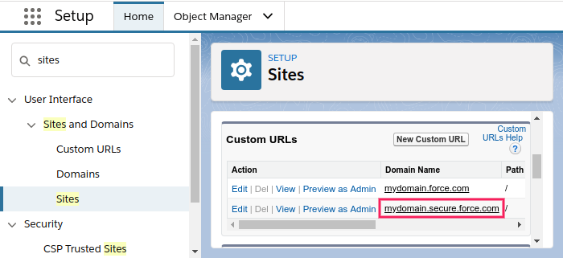

# Troubleshooting

## Calls not connecting or disconnecting instantly

- Validate Twiml App
  - Navigate to **Setup >> User Interface >> Sites and Domains >> Sites**
  - Click on the label of **dialero** site
  - At the **Custom URLs** section look for the secure **Domain Name** 
  - Log into Twilio account and navigate to **Phone Numbers >> Twiml Apps**
  - Click on **Dialero App** and verify that the Site Domain Name matches the URLs 
  - If the URLs do not match, update them with the following format:
    - **Request Url** should be: `https://DOMAINNAME/dialero__dc` where DOMAINNAME is the secure Site Domain Name
    - **Status Url** should be: `https://DOMAINNAME/dialero__ds` where DOMAINNAME is the secure Site Domain Name
  * Click **Save**
- [Validate enabled Site Visualforce pages](configure-site#configure-site-pages)
- [Validate Site User Permissions and License](configure-site#configure-permissions-and-package-license-for-site-user)
- If assigning Permission Set fails, grant all the permissions manually:
  - Navigate to **Setup >> User Interface >> Sites and Domains >> Sites**
  - Click on the label of **dialero** site
  - Click on **Public Access Settings** button
  - Edit the profile, grant the following permissions:
    - For Objects:
      - Contact and Lead: **Read**
      - Call: **Full Permissions**
    - For Field-Level Security:
      - Contact and Lead: **Read Access** on all phone and name related fields (Name, Full Name, Phone, Mobile, etc.)
      - Call: **Full Access** on all fields

---

## Page dialero does not exist error

- Navigate to Call Centers section in Setup
- Click **Edit** next to **dialero** entry
- Verify that the **Adapter URL** value is one of the following options:
  - `/apex/dialero__dialero`
  - `/apex/dialero`
- Click **Save**

---

## Unauthorized endpoint error

- [Activate Remote Site](dialero_softphone_setup_site.html#register)

---

## I've setup everything but cannot see Dialero component or Dialero App

- Navigate to Dialero Setup page in Setup >> Installed packages >> Configure
- Navigate to Manage Users Tab
- Verify that the users that don't see the component or the app are enabled and have licences
