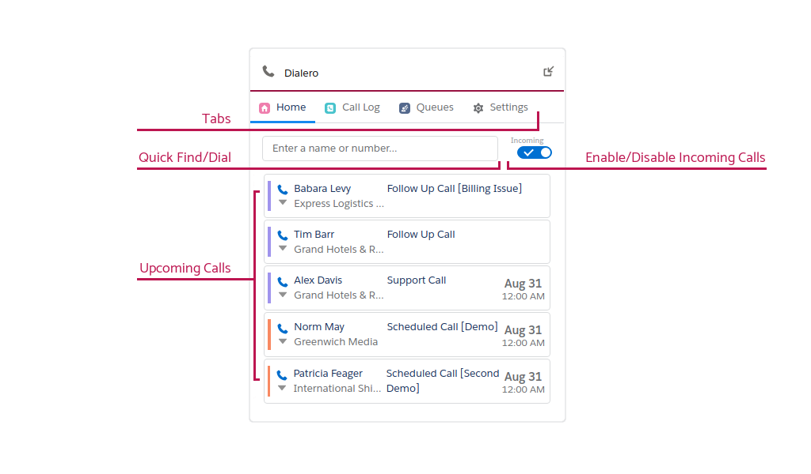
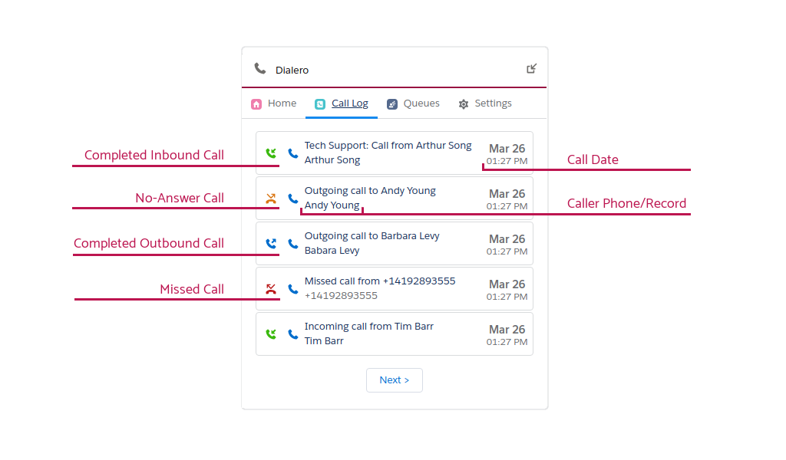
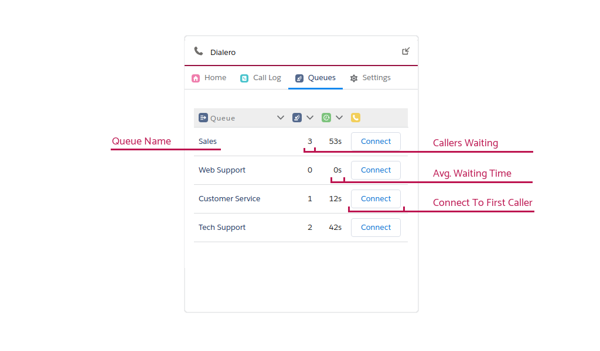
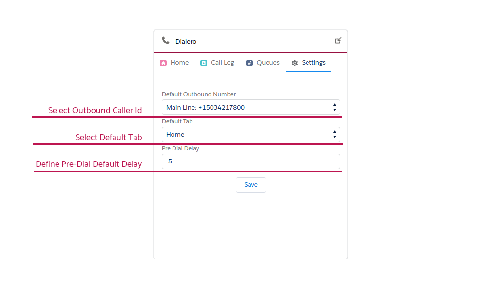

# Dialero Softphone Overview

## Standby Tab

- Use **Tabs** to navigate between Standby, Call Log, Queues and Settings tabs.
- Use **Quick Find/Dial** field to quickly find contacts or dialing to any phone number. [More info](making-calls#quick-dial)
- **Enable/Disable Incoming Calls** by toggling the button.
- **Upcoming Calls** will reflect any uncompleted tasks with `Call` word included in the subject.

---

## Call Log Tab

- View all your completed calls.
- Status icons represent the direction and result of the call:
  -  Outbound Completed
  -  Outbound Missed
  -  Inbound Completed
  -  Inbound Missed
- To dial the caller click on the blue phone icon 
- Clicking on the subject will open the related task.
- If the caller was identified as Contact/Lead, clicking on the name will open the related record of the caller.

---

## Queues Tab

Beta Feature

---

## Settings Tab

- **Set Default Outbound Id** to be any Twilio Verified phone number.
  - **Lite Edition** limited to 2 Twilio Phones.
  - **Pro Edition** can use unlimited Twilio Phones or Caller Ids.
- **Select Default Tab** will enable changing the default Standby Tab to Call Log or Queues.
- **Define Pre-Dial Delay** to control the delay in seconds between a Click-To-Dial action and actually starting the call. This enables an opportunity to cancel an outgoing call before it was placed. Put `0` value to disable any delay.
