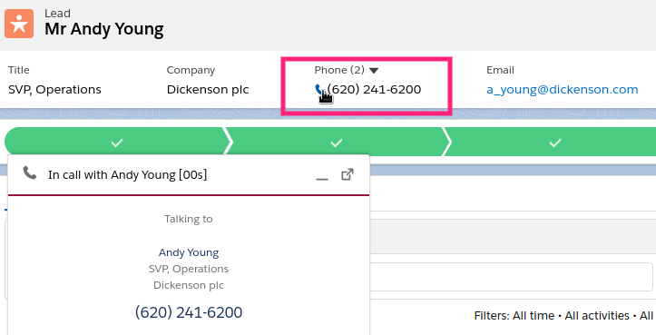
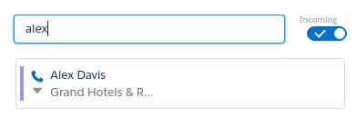

# Making Outgoing Calls

## International Calls

For making international calls, use the full phone number including the country code.

## Click To Dial {#click-to-dial}

Click on the blue phone icon  next to any phone field on any Salesforce record to start outgoing call.

---

## Quick Find/Dial In Standby View {#quick-dial}

The Quick Find/Dial search field will try to locate the Contact/Lead or will function as a Phone input field.

- To search for existing Contact/Lead, enter a few letters of the name of a Contact or Lead in the Quick Find field at the Standby View to start your search. Click on the blue phone icon  next to the Contact/Lead name to dial. 
- To dial to a phone, type in the full phone number and click on the Dial button that will appear. 
