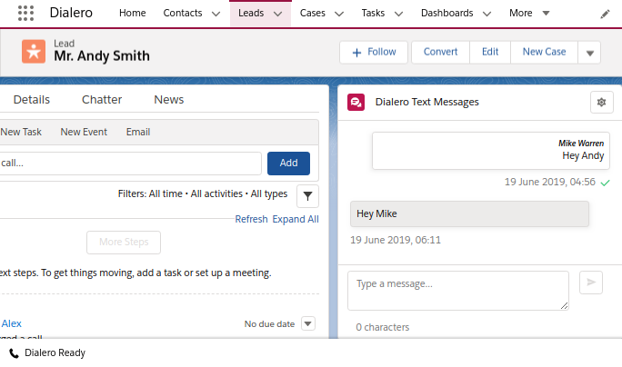

# Dialero SMS Messaging

## Add The 1-on-1 Messaging Component To Record Page

<video controls width="100%" controlsList="nodownload">
  <source src="/video/messaging.mp4" type="video/mp4"></source>
</video>

- Using the component requires deployed **My Domain** feature, please follow [this guide](https://help.salesforce.com/articleView?id=domain_name_overview.htm) before proceeding.
- From the record detail page, click on **Setup >> Edit Page**
- Scroll down on the left sidebar and find the **Dialero Text Messages** component in the **Custom** section.
- Drag the component to desired area in the page layout.
- Click **Save** and follow the process to assign and activate the page layout.

---

## Sending Messages From The 1-on-1 Component

- **Verify** that valid phone numbers selected by clicking on the top right configuration button and selecting the proper From and To phone numbers before sending the message.
- Type your message in the bottom text area, counter for the characters in the message will provide feedback for how many characters used in the current message. Standard SMS message is limited to 160 characters, if more characters used, the message will be split into multiple messages.
- Click **Send** when done typing.

---

## Setting Up Automated Messages

<video controls width="100%" controlsList="nodownload">
  <source src="/video/auto-sms.mp4" type="video/mp4"></source>
</video>

Sending Automated SMS text message is achieved from the Process Builder and applicable to any object with phone fields.

In this example, Lead object is chosen to demonstrate the setup process.

After defining the flow logic with the Process Builder, for process **Actions** choose:

- Type: **Apex**
- Apex Class: **Dialero Send SMS**

Add the following rows for the **Apex Variables**:

- Sender Phone Number: The Twilio SMS supported phone number in your account, this is the number the SMS will be sent from.
  - Type: String
  - Value: Phone Number
- Recipient Phone Number: The phone number of the recipent that will receive the SMS message.
  - Type: Field Reference
  - Value: Mobile Phone or any phone field that has a SMS supported number.
- SMS Text Body: This is text that will be the body of the SMS message.
  - Type: String/Formula
  - Use String to set non-dynamic messages, for dynamic messages use Text Formula. For example, to send a 'Hi {Name}!' message, use the formula: `'Hi ' & [Lead].FirstName & '!'`
